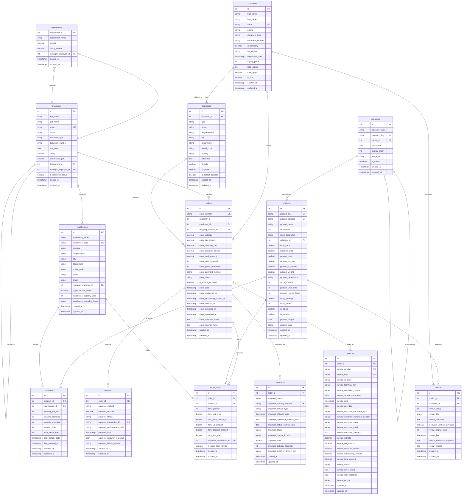

# Sistema de Comercio Electrónico (E-Commerce Platform)

Este proyecto es un ejemplo práctico de cómo usar **Doctrine ORM** en PHP para construir una plataforma robusta de comercio electrónico. Doctrine ORM es una biblioteca de mapeo objeto-relacional que permite a los desarrolladores trabajar con bases de datos utilizando objetos, facilitando la gestión de datos complejos.

### Visión General del Sistema

Este sistema simula una plataforma completa de comercio electrónico similar a Amazon, Shopify o MercadoLibre. Maneja todo el ciclo de vida de un pedido: desde que un cliente navega productos, hasta que recibe su paquete y deja una reseña.

### Diagrama Entidad-Relación

